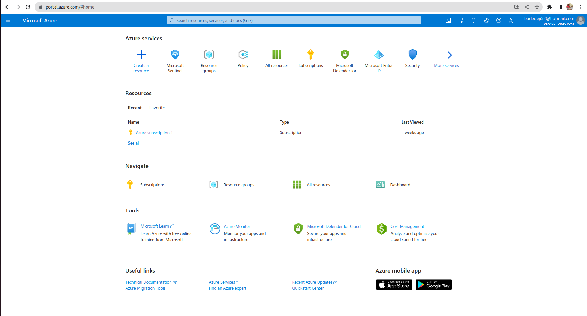
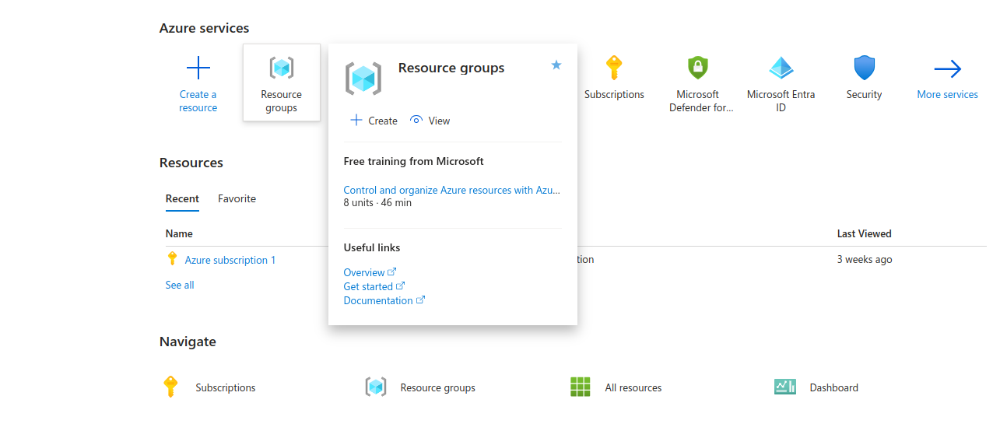
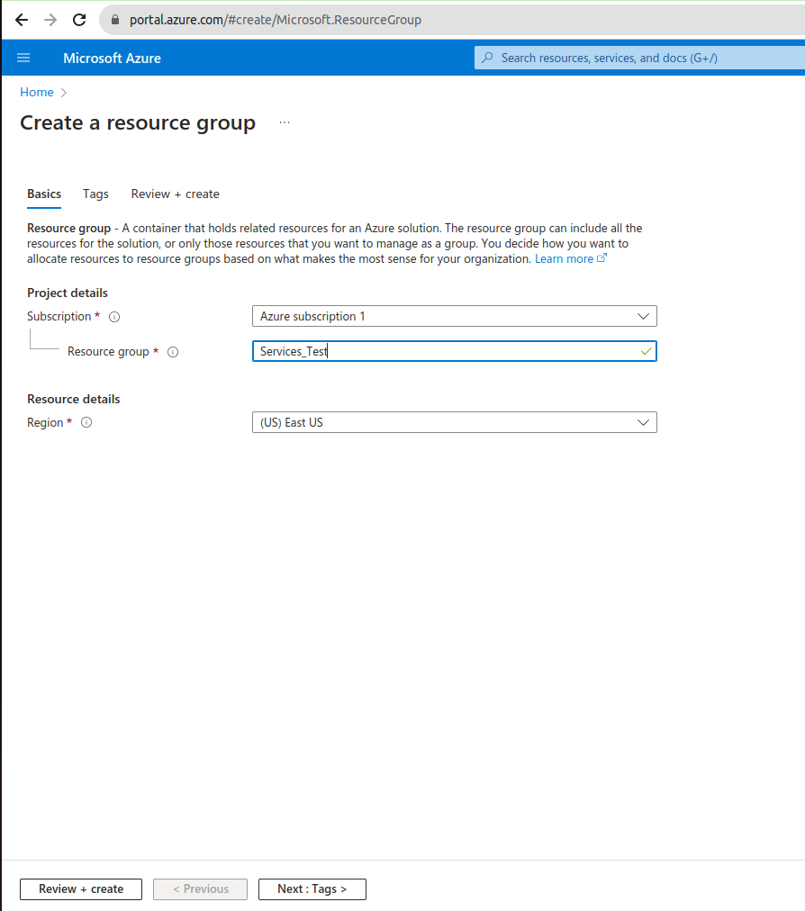
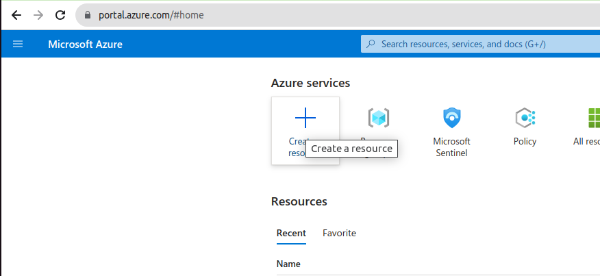
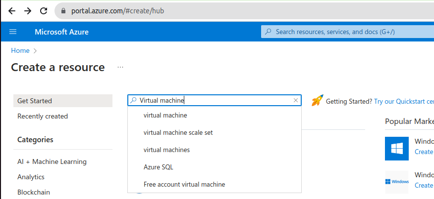
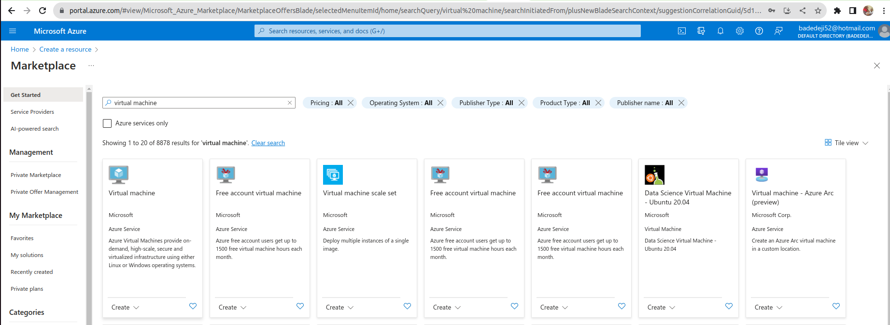
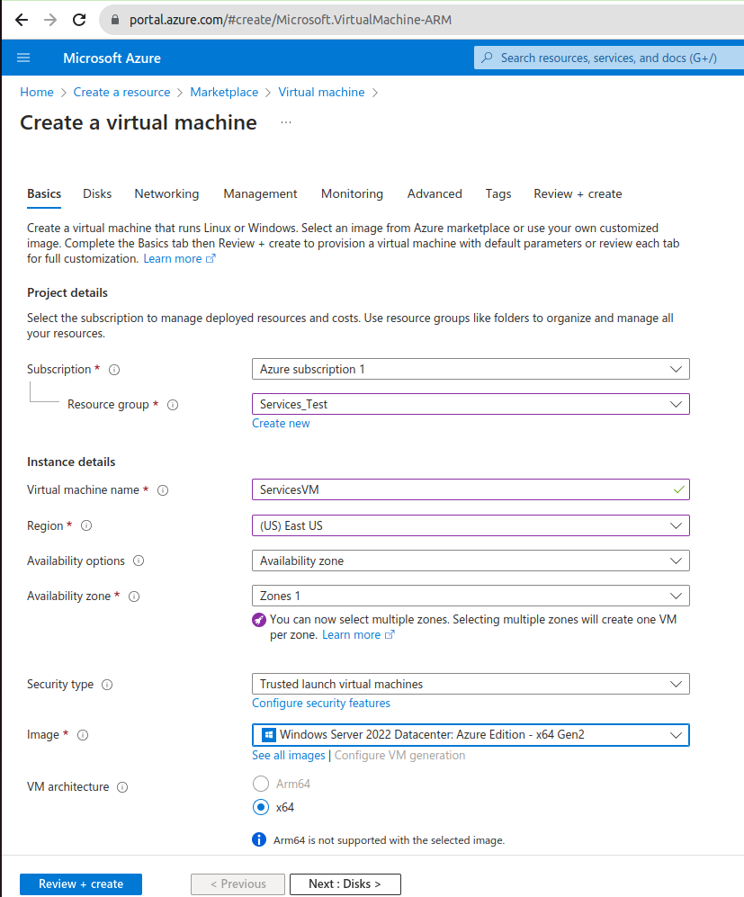
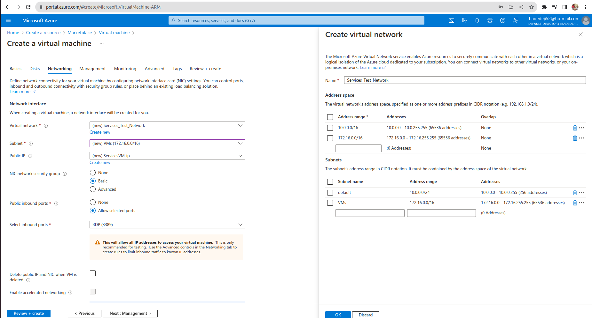
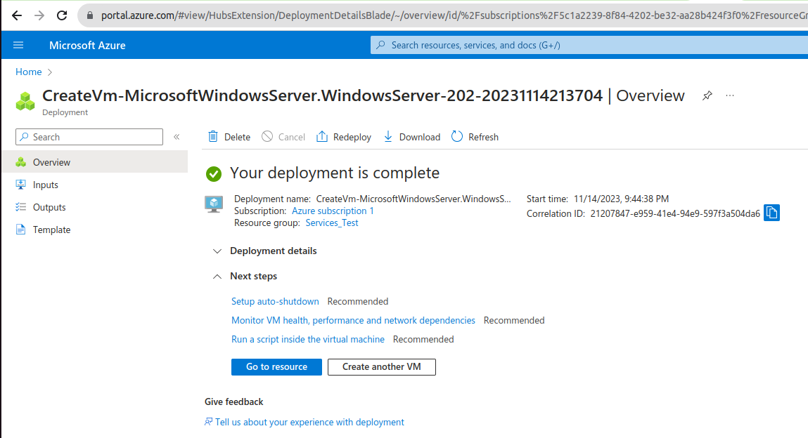
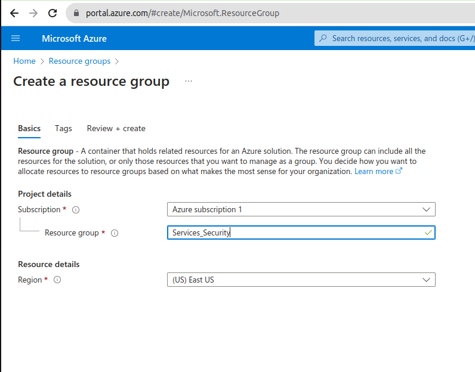

## Create Virtual Machine ##

1. Login to Azure Portal at [Azure Portal](www.portal.azure.com)

After a successful login, you should have a page like this:

2. Create a Resource Group to which the VM will belong
   Click on Resource Group icon
   
   Provide the Resource Group name and create it
   

3. Create a Virtual Machine
   Login to the Azure Portal
   Select Create a Resource
   

   Search for Virtual Machine in the new page
   

   Click on Virtual Machine tab

   

   Complete the Basic tab of the Virtual Machine configuration according to your requirements

   

   Cycle through all the tabs (Disk, Networking, etc.) to complete the VM configuration
   You will need to create vnet and IP address subnet to be used on the vnet
   
   
   Click Create to create the Virtual Machine
   Wait until deployment is complete. May take some time.

   

4. Create a Hub network with VNet peering
   Create a hub network with VNet peering to the Service_Test_Network, all inside a new resource group, ready for an Azure Standard Firewall deployment.
   To complete this task, we will create a Resource Group, a Hub Vnet, a subnet

   Create a resource group named Services_Security

   
   
